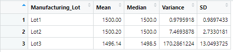
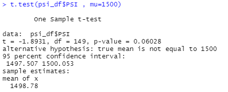
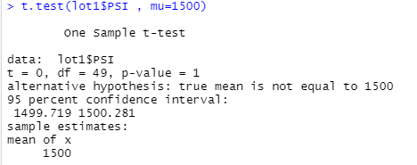
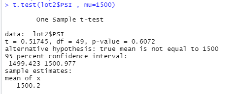
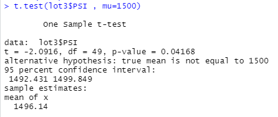

# MechaCar_Statistical_Analysis

## Linear Regression to Predict MPG

- Which variables/coefficients provided a non-random amount of variance to the mpg values in the dataset?

  By looking at p-values of each variable ,Vehicle_length and ground_angle (as well as intercept)have a p-value of less than 5% meaning they have non-random amounts of variance to the mpg values..   

- Is the slope of the linear model considered to be zero? Why or why not?

  By looking at the p-valueof our linear regression(5.35e-11) which is much smaller than 5% , Therefore there is sufficient evidence to reject Null Hypothesys, which means that the slope of our linear model is not zero. 

- Does this linear model predict mpg of MechaCar prototypes effectively? Why or why not?

  According to R-Squared value of over 0.7 , we can say the probability metric of the linear model is 70% .Having said that we have an intercept that is statistically significant and that means there are other variables and factors that contribute to the variation in mpg.  
  
## Summary Statistics on Suspension Coils
 
 - The design specifications for the MechaCar suspension coils dictate that the variance of the suspension coils must not exceed 100 pounds per square inch. Does the current manufacturing data meet this design specification for all manufacturing lots in total and each lot individually? Why or why not?
 
   According to our total summary table the varaince summary for all lots as a whole (62.29) meets the criteria , However by looking at the lot summary table, Lot3 has a variance of 170.29 pounds per square inch which exceeds 100 and doesn't meet design criteria.The reason for keeping the variance of the total low is that the variances in lots 1 and 2 are way lower than 100 which affects the total variance for the manufacturer.
 

**Total Summary Table** 

**Lot Summary Table**

 

## T-Tests on Suspension Coils

By looking at t-test result across all manufacturing lots, the p_value (0.06) is more than 5% that means we don't have enough evidences to reject our null hypothesis which states there is no statistical difference between true mean and 1500 or true mean equals 1500. 

Below is the t-test for lot1 and Lot2. p-values are more than 5%. That means we can not reject null Hypothesis as mentioned above.

By looking at the t-test for lot3, we find p-value is less than 5%. That means we can reject Null Hypothesis and accept that the mean is not equal to 1500. 

## Study Design: MechaCar vs Competition

- One of the metrics that can quantify the performance of MechaCar against the competition is the safety rating of a car. We can use analytics tests to see if MechaCar is different from other compatition in the market in terms of safety of the cars they make.

- The Null Hypothesis is " There is no difference between MechaCar and other competition " and our Alternative Hypothesis would be the opposite.

- We will use a t-test to compare the population for all the vehicle types of other competitors and compare the p-value against the significance level.

- The dataset should includes the safety ratings that are numerical and continuous.I would use 5 manufacturers with 500 data points each randomly to create a sample size .

